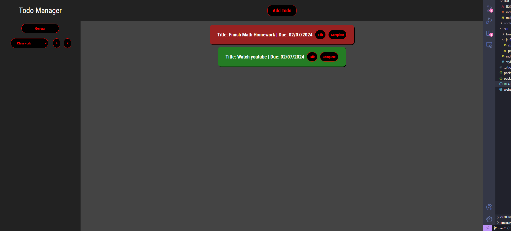

# todo-list
For this project, I designed a "Todo" manager in the browser. It permits users
to create new projects or operate under the "General" project to store their todos.
Todos can be created and given unique names, descriptions, due dates and priorties. 
The color of todos changes with their priority, and the information can be edited/
expanded. It was designed using Javascript, HTML, and CSS. It also utilized the date-fns
API as well as webpack and npm for project management.

#URL
https://matt-mcauley.github.io/todo-list

# Author
Matthew McAuley  
mwm223@cornell.edu  
https://github.com/matt-mcauley/etch-a-sketch  